# NFT租赁平台

[NFT租赁平台 1](#nft租赁平台)

[一、系统需求： 3](#一系统需求)

[二、架构总览 3](#二架构总览)

[2.1 设计目标与原则 3](#21-设计目标与原则)

[2.2系统架构图 3](#22系统架构图)

[2.3技术选型 4](#23技术选型)

[三、详细设计 5](#三详细设计)

[3.1智能合约架构 5](#31智能合约架构)

[3.1.1合约关系图 5](#311合约关系图)

[3.1.2核心机制 5](#312核心机制)

[3.2数据模型 6](#32数据模型)

[3.3业务流程图 7](#33业务流程图)

[3.3.1承租人租赁NFT 7](#331承租人租赁nft)

[3.3.2承租人赎回押金并归还NFT 9](#332承租人赎回押金并归还nft)

[3.3.3出租人清算 10](#333出租人清算)

[3.3.4出租人取消出租 12](#334出租人取消出租)

[3.3.5出租人提取租金 12](#335出租人提取租金)

[四、安全考虑与测试策略 12](#四安全考虑与测试策略)

[4.1 安全设计 12](#41-安全设计)

[4.2 全面的测试策略 13](#42-全面的测试策略)

[五、部署与运维 13](#五部署与运维)

[5.1 网络部署 13](#51-网络部署)

[5.2 监控 13](#52-监控)

[六、未来演进与构思 14](#六未来演进与构思)

[6.1功能扩展 14](#61功能扩展)

[6.2架构优化 14](#62架构优化)

[6.3运维增强 14](#63运维增强)

[附录一、合约概览 15](#附录一合约概览)

[1.1合约接口说明 15](#11合约接口说明)

[1.1.1 RNNFT合约 15](#rnnft合约)

[1.1.2 RTRentMarket合约 16](#112-rtrentmarket合约)

[存储槽布局 16](#存储槽布局)

[函数 16](#函数)

[附录二、测试报告（含各工具输出摘要） 18](#附录二测试报告含各工具输出摘要)

[2.1静态分析报告：Slither 18](#21静态分析报告slither)

[2.1.1 RTNFT合约 18](#211-rtnft合约)

[2.1.2 RTRentMarket合约 18](#212-rtrentmarket合约)

[2.2动态分析报告：Mythril 19](#22动态分析报告mythril)

[2.2.1 RTNFT 19](#221-rtnft)

[2.2.2 RTRentMarket 20](#222-rtrentmarket)

[2.3路径分析 20](#23路径分析)

[2.3.1承租人租赁NFT 20](#231承租人租赁nft)

[Calldata 21](#calldata)

[存储 22](#存储)

[分析结果 22](#分析结果)

[2.3.2承租人赎回押金并归还NFT 27](#232承租人赎回押金并归还nft)

[Calldata 27](#calldata-1)

[存储 28](#存储-1)

[分析结果 28](#分析结果-1)

[2.3.3出租人清算 30](#233出租人清算)

[Calldata 30](#calldata-2)

[存储 31](#存储-2)

[分析结果 31](#分析结果-2)

[2.3.4出租人取消出租 32](#234出租人取消出租)

[Calldata 32](#calldata-3)

[存储 33](#存储-3)

[分析结果 33](#分析结果-3)

[2.3.5出租人提取租金 34](#235出租人提取租金)

[存储 34](#存储-4)

[分析结果 34](#分析结果-4)

[2.4单元测试报告 35](#24单元测试报告)

[2.4.1单元测试用例 35](#241单元测试用例)

[2.4.2执行报告 35](#242执行报告)

[2.4.3结果分析 36](#243结果分析)

[2.5模糊测试报告 36](#25模糊测试报告)

[2.5.1模糊测试用例 36](#251模糊测试用例)

[2.5.2执行报告 37](#252执行报告)

[--fuzz-runs=100 37](#--fuzz-runs100)

[--fuzz-runs=500 37](#--fuzz-runs500)

[--fuzz-runs=2000 37](#--fuzz-runs2000)

[--fuzz-runs=5000 38](#--fuzz-runs5000)

[--fuzz-runs=10000 38](#--fuzz-runs10000)

[2.5.3结果分析 38](#253结果分析)

[2.6形式化验证报告 38](#26形式化验证报告)

[2.6.1形式化验证测试用例 38](#261形式化验证测试用例)

[2.6.2执行报告 39](#262执行报告)

[z3 39](#z3)

[yices 39](#yices)

[cvc5 40](#cvc5)

[2.6.3结果分析 40](#263结果分析)

[2.7不变测试报告 40](#27不变测试报告)

[2.7.1不变测试用例 40](#271不变测试用例)

[2.7.2不变测试Handler 40](#272不变测试handler)

[2.7.3执行报告 41](#273执行报告)

[2.7.4结果分析 43](#274结果分析)

[附录三、合约部署 44](#附录三合约部署)

[3.1部署与验证脚本 44](#31部署与验证脚本)

[3.2合约地址 44](#32合约地址)

# 一、系统需求：

本项目是一个基于以太坊的去中心化NFT租赁市场，允许用户出租和租用NFT，为NFT生态提供流动性，使资产所有者（出租人）能够获得被动收益，同时让使用者（承租人）以较低成本获得NFT的临时使用权。并通过超额抵押和罚金机制管理风险。

具体需求如下：

1.  展示热门 NFT 集合；
2.  可浏览上架出租的 NFT；
3.  自定义费用（ETH）.时间.押金（ETH） 上架NFT；
4.  支付费用和押金（ETH）来租下NFT；
5.  到期归还NFT，赎回押金；
6.  每逾期一天，收取 1% 费用，从押金中扣除；
7.  逾期12天后，出租方可选择强制清算，放弃NFT，获得全部押金。

特别说明：为避免外部NFT带来的复杂性，本实战实现时已降低实现复杂度，NFT使用自研合约RTNFT，押金以及租赁费用均使用原生ETH支付

## 二、架构总览

### 2.1 设计目标与原则

-   **安全性第一**: 所有设计决策优先考虑资金与资产安全，通过严格的测试和审计流程保障。
-   **去中心化**: 核心业务逻辑（资产托管.租赁.清算）链上化，确保协议的透明与可信。
-   **用户体验**: 通过离线签名（Gasless）降低用户操作成本，前端响应迅速。
-   可扩展性: 本系统暂未考虑可扩展性，仅使用自开发NFT租赁，若考虑扩展性可使用ERC标准接口替代进行解耦，便于未来扩展至其他链或支持多币种。

### 2.2系统架构图

采用Solidity开发智能合约，基于TheGraph索引链下数据；使用Pinata进行元数据存储；通过全面的测试策略（单元测试.模糊测试.形式化验证）保障合约安全合约使用；并通过PrismaPostgress存储离线签名及租赁等链下信息；前端集成Wagmi/Viem/AppKit；Vercel进行网站托管。

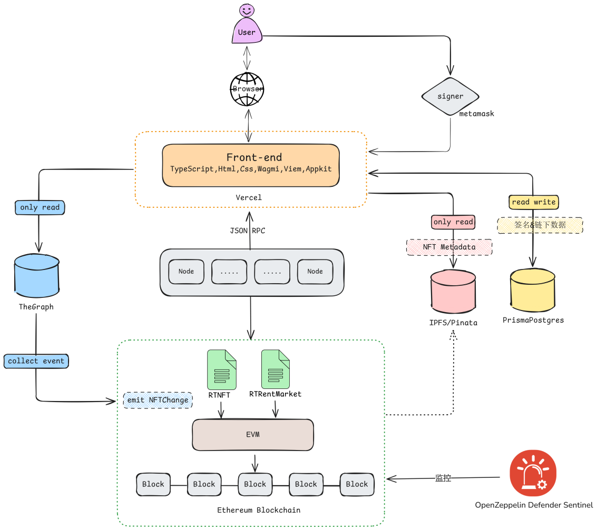

### 2.3技术选型

| **组件**   | **技术选型**                   | **选型依据及考量**                                                       |
|------------|--------------------------------|--------------------------------------------------------------------------|
| 智能合约   | Solidity, OpenZeppelin         | 行业标准，经过实战检验，拥有最丰富的库和审计资源。                       |
| 开发框架   | Foundry                        | 现代化的开发体验，内置强大的测试（Fuzz/Invariant）和调试工具，编译速度快 |
| 前端框架   | Next.js, AppKit                | Next.js提供优秀的SSR和开发体验，AppKit提供无缝的钱包集成方案。           |
| 以太坊交互 | Wagmi, Viem                    | 类型安全.模块化设计，比传统的ethers.js更现代，功能更强大                 |
| 数据索引   | TheGraph                       | 去中心化索引网络的标杆，高效地将链上事件转换为可查询的GraphQL API。      |
| 元数据存储 | Pinata (IPFS)                  | 提供可靠的IPFS上传和pin服务，确保NFT元数据长期可用                       |
| 数据库     | PostgreSQL, PrismaPostgress    | 强大的关系型数据库，Prisma提供类型安全的ORM访问，适合存储链下关联数据    |
| 部署托管   | Vercel                         | 极佳的前端开发者体验，与Next.js无缝集成，自动化部署与全球CDN             |
| 监控       | Openzeppelin Defender Sentinel | 与合约运维流程深度集成，提供开箱即用的监控和自动化响应能力               |

## **三、详细设计**

### 3.1智能合约架构

#### 3.1.1合约关系图

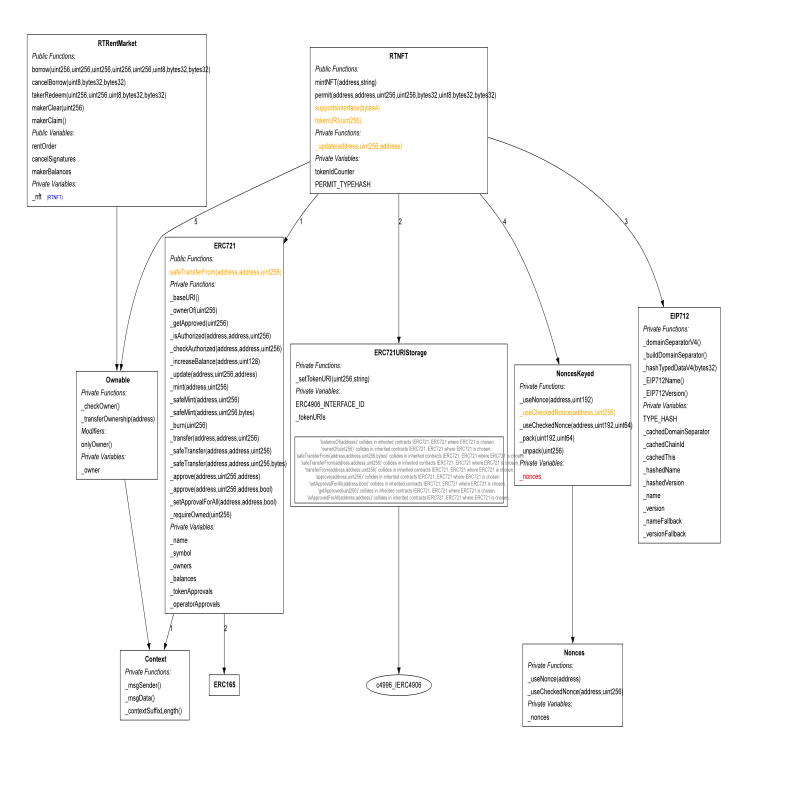

**RTNFT:** 资产层。负责NFT资产的生成和所有权管理。通过集成EIP-712 permit方法，实现了基于签名的授权，为无Gas租赁流程提供基础。

**RTRentMarket:** 逻辑与资金层。核心业务合约，处理租赁订单的生命周期（创建.执行.赎回.清算），并作为租金和押金的托管方。

#### 3.1.2核心机制

-   **无租赁上架**: 通过出租人签署EIP-712结构化消息来发布租赁条款，无需上链交易，实现零Gas费上架。
-   **租赁执行**: 承租人通过调用borrow()函数，支付租金和押金并传入出租人签名，单笔交易即可完成支付和NFT转移。
-   **资金安全模型**: 采用提款模式。租金累积在合约映射中，由出租人主动提取，彻底规避重入风险。押金由合约托管，根据赎回时的条件进行结算。
-   **罚金机制**: 逾期罚金按日计算（1%/天），设有100天上限，逻辑清晰且通过自动化测试防止溢出。
-   **清算机制**: 逾期超过12天后，出租人可主动清算，获得全部押金，放弃NFT所有权，此机制平衡了出租人的资金效率和承租人的赎回权益。

### 3.2数据模型

**核心状态变量 (RTRentMarket.sol)**

| **变量名**       | **类型**                       | **描述**               |
|------------------|--------------------------------|------------------------|
| makerBalance     | mapping(address =\> uint256)   | 出租人待提取的租金余额 |
| cancelSignatures | mapping(bytes32 =\> bool)      | 已取消的签名哈希       |
| rentOrder        | mapping(uint256 =\> OrderInfo) | 租借订单列表           |

**RTRentMarket.OrderInfo**

| **字段**   | **类型**        | **描述**                                           |
|------------|-----------------|----------------------------------------------------|
| maker      | address         | 出租人地址                                         |
| collateral | uint256         | 押金数量 (ETH)                                     |
| taker      | address         | 承租人地址                                         |
| expiryTime | uint256         | 租赁到期时间戳                                     |
| orderState | enum OrderState | 订单状态(Unknown, Borrowing, Redeemed, MakerClear) |

### 3.3业务流程图

#### 3.3.1承租人租赁NFT

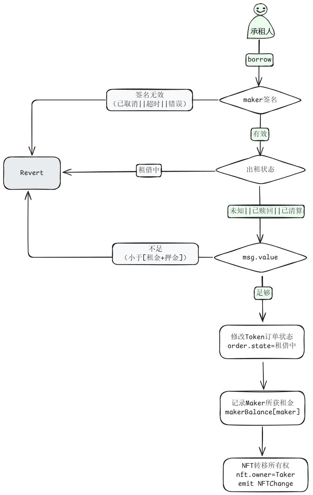

#### 3.3.2承租人赎回押金并归还NFT

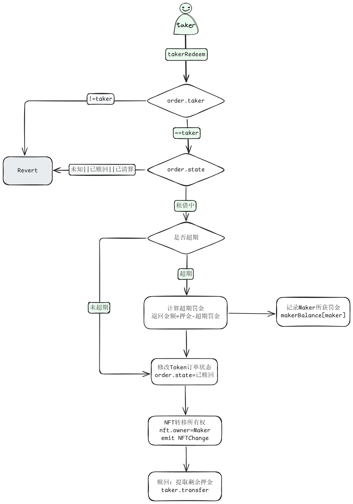

#### 3.3.3出租人清算

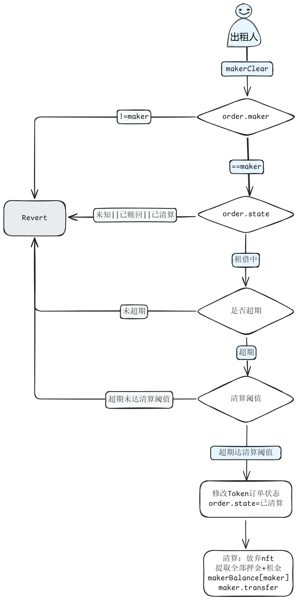

#### 3.3.4出租人取消出租

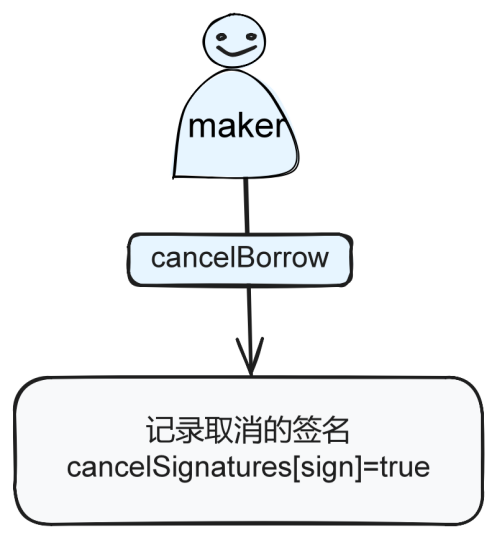

#### 3.3.5出租人提取租金

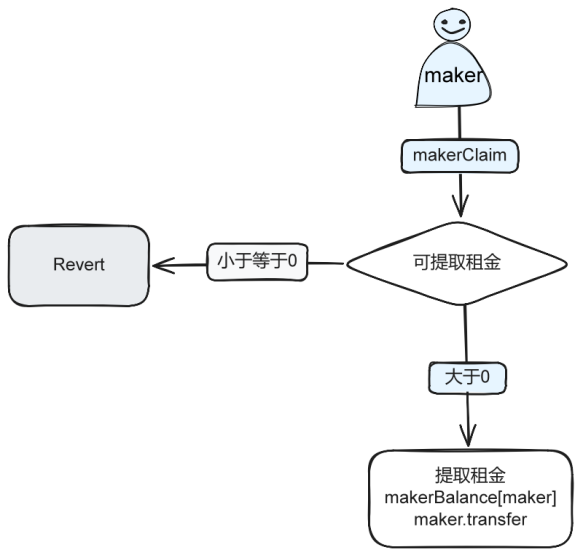

## 四、安全考虑与测试策略

### 4.1 安全设计

-   **重入攻击防护**: 严格遵循 检查-修改-交互 模式，所有外部调用（如 NFT 转移）均在最后执行。资金提取采用 Pull 模式。
-   **整数溢出/下溢**: 使用Solidity 0.8.x内置的SafeMath。
-   **签名重放**: 使用 EIP-712 域分离确保签名仅适用于本合约和当前链。通过 cancelSignatures 映射支持签名撤销。

### 4.2 全面的测试策略

实施了区块链领域领先的测试方案，构建了多层次的质量保证体系：

-   静态分析 (Slither)：通过，已处理所有关键问题。
-   动态分析（Mythril）：通过，未发现漏洞。
-   单元测试（Foundry）：19个用例，100%覆盖核心业务路径，验证了每个函数的预期行为。
-   模糊测试（Foundry）：万次级运行，使用随机输入探索参数边界和极端情况，验证计算。
-   不变测试（Foundry）：验证了在随机函数调用序列的干扰下，系统状态变量始终保持不变，模拟了真实的链上环境。
-   形式化验证（Halmos）：使用多引擎求解器（Z3, Yices, Cvc5），数学证明了核心逻辑在所有可能输入下的正确性，未发现反例。这是最高级别的安全保证。

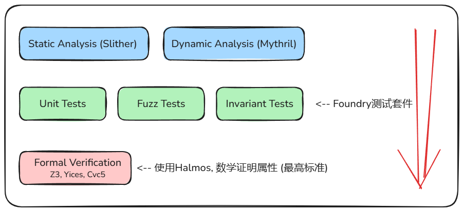

## 五、部署与运维

### 5.1 网络部署

本次合约拟部署在Ethereum Sepolia分叉网络，并对合约进行开源验证。

### 5.2 监控

-   **链上事件监控**: 使用TheGraph索引OrderChange等事件，为前端提供高效查询。
-   **业务风险监控**: 使用 OpenZeppelin Defender Sentinel 设置监控告警，例如：

    监控 makerClear 清算事件。

    监控异常大额租赁订单。

-   **基础设施监控**: 监控 Pinata IPFS 网关的可用性，确保元数据可访问。

## 六、未来演进与构思

### 6.1功能扩展

-   **多资产支持**：通过接口抽象，支持 ERC721A.ERC1155 等更多 NFT 标准。支持 WETH.USDC 等主流 ERC-20 代币作为支付方式。
-   **租赁模式创新**：

    实现“订阅制”租赁，租赁者可以发布某类NFT的租赁需求，由NFT所有者接收申请并租赁。

    集合打包租赁；

    拍卖式租赁等

-   **信誉与评分系统**：构建链上信誉系统，为高信誉用户提供更低押金等优惠，提升生态系统质量，保证平台良性可持续发展。

### 6.2架构优化

-   **升级策略**: 当前合约未设计可升级性。未来如需升级，可采用代理模式（如UUPS）进行改造部署。
-   **扩容方案**：业务量若增加可探索Layer 2解决方案（如Optimism, Arbitrum,Polygon）以降低Gas成本以及响应时间。
-   **去中心化治理**: 引入治理代币和 DAO，逐步将协议参数控制权移交社区

### 6.3运维增强

-   **事件响应手册**: 编写详尽的应急预案，应对可能的安全事件或极端市场条件。
-   **多链部署**: 将协议部署至更多生态系统，如 Polygon.BNB Chain。
-   **数据分析平台**: 构建内部看板，分析协议使用情况.热门资产等数据，指导业务决策
-   **监控**：构建多监控渠道，如OpenZeppelin Defender Sentinel + Forta机器人组合监控，第一时间介入。

## 附录一、合约概览

### 1.1合约接口说明

#### RNNFT合约

minNFT函数，用于铸造时metadata的IPSF地址的初始化；

permit函数，用于ERC2612实现；

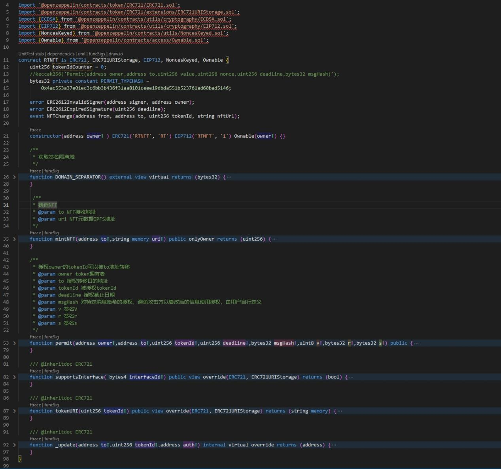

#### 1.1.2 RTRentMarket合约

##### 存储槽布局

###### RTNFT

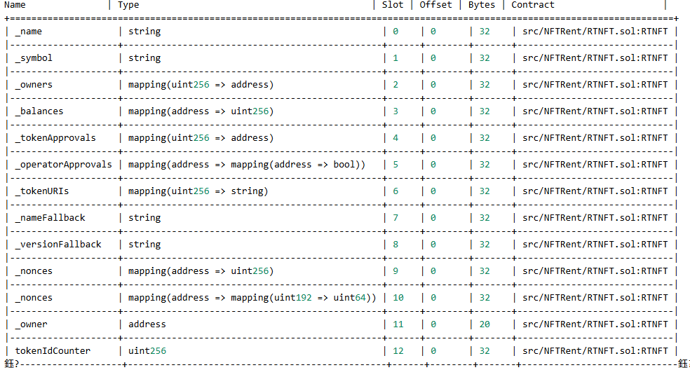

###### RTRentMarket

##### 函数

borrow：承租人租赁NFT

cancelBorrow：避免出租人离线签名取消后被使用，需要标记签名取消

takerRedeem：承租人赎回押金

makerClear：承租人超期时长已打可清算时间，出租人放弃NFT，执行清算

makerClaim：承租人租赁时会记录出租人所获取的租金，出租人使用提款模式获取租金

## 附录二、测试报告（含各工具输出摘要）

### 2.1静态分析报告：Slither

本次静态分析采用slither工具进行分析。

#### 2.1.1 RTNFT合约

执行如下命令：

slither src/NFTRent/RTNFT.sol --filter-paths "openzeppelin"

结果如下图,slither检测出的其他问题均已修复，但仍有两处建议：

1.  使用了矿工可操纵的时间戳block.timestamp,由于时间戳仅用于验证签名时间是否过期，所以本建议忽略；
2.  建议使用混合大小写，函数DOMAIN_SEPARATOR()获取域隔离标志的哈希，该代码借鉴了opezeppelin ERC20Permit的实现，参考其大小写命名

#### 2.1.2 RTRentMarket合约

执行如下命令：

slither src/NFTRent/RTRentMarket.sol --filter-paths "openzeppelin"

结果如下图，同RTNFT合约的timestamp&mixedCase：

### 2.2动态分析报告：Mythril

本次动态分析采用Mythril进行分析，Windows系统无法直接运行Mythril，故需安装docker容器以mythril/myth镜像执行测试。

所需配置mythril.config.json如下：

{

"remappings": [ "@openzeppelin/=/tmp/lib/openzeppelin-contracts/", "./=/tmp/src/NFTRent/"],

"optimizer": {

"enabled": true,

"runs": 200

}

}

#### 2.2.1 RTNFT

执行如下命令：

docker run -v D:/AWorkSpace/Web3/SoliditySpace/nftrent-main/nftrent-contracts:/tmp mythril/myth analyze /tmp/src/NFTRent/RTNFT.sol --solc-json /tmp/mythril.config.json

\-o json

执行结果如下，mythril分析无漏洞：

#### 2.2.2 RTRentMarket

执行如下命令：

docker run -v D:/AWorkSpace/Web3/SoliditySpace/nftrent-main/nftrent-contracts:/tmp mythril/myth analyze /tmp/src/NFTRent/RTRentMarket.sol --solc-json /tmp/mythril.config.json -o json

执行结果如下，mythril分析无漏洞：

### 2.3路径分析

分析每个函数calldata传参带来的各种路径情况；确保合约存储变量的前置条件；以及运行结束后哪些状态变量应该保持不变，哪些应该按要求发生变化，以及多种变化路径；最后确认需要提交的事件。

根据路径分析的结果，**单元测试**覆盖率可达90%以上；分析得出的可达路径可供后续测试，包括**模糊测试.形式化验证**以及**不变量测试。**

#### 2.3.1承租人租赁NFT

租赁时前端会读取出租人的离线签名以及出租信息传入函数，本次测试仅考虑业务场景，不覆盖签名超时.签名错误的情况。

##### Calldata

##### 存储

##### 分析结果

[calldata]中存在一条可达路径，综合[存储]得出3条可执行的正常路径，7条revert路径，以线性时序逻辑 (LTL) 语言表示如下：

###### WillSucceed：Token的订单状态是未知

,cancelSignatures[rsv]==false&&ownerOf(tokenId)！=msg.sender&&ownerOf(tokenId)== recover(vrs) && msg.value \>= dailyRent\*rentalDuration+collateral&& dailyRent\*rentalDuration \< 0x10000000000000000000000000000000000000000000000000000000000000000 &&dailyRent\*rentalDuration+collateral \< 0x10000000000000000000000000000000000000000000000000000000000000000&&dailyRent\*rentalDuration+makerBalance(ownerOf(tokenId)) \< 0x10000000000000000000000000000000000000000000000000000000000000000&&rentOrder[tokenId].orderState==OrderState.Unknow)) ==\> \<\>(finished(contract.borrow(tokenId,dailyRent,rentalDuration,collateral,deadline,v,r,s), return == true ==\>rentOrder[tokenId]==OrderInfo(ownerOf(tokenId),msg.value - dailyRent\*rentalDuration-collateral,msg.sender,block.timestamp+rentalDuration\*86400,OrderState.Borrowing)&&cancelSignatures[ownerOf(tokenId)]==old(cancelSignatures[ownerOf(tokenId)])&&makerBalance[ownerOf(tokenId)]+=dailyRent\*rentalDuration&&contract.balance==old(contract.balance) +msg.value&&new(ownerOf(tokenId))==msg.sender)))

###### WillSucceed：Token的订单状态是已赎回

,cancelSignatures[rsv]==false&&ownerOf(tokenId)！=msg.sender&&ownerOf(tokenId)== recover(vrs) && msg.value \>= dailyRent\*rentalDuration+collateral&& dailyRent\*rentalDuration \< 0x10000000000000000000000000000000000000000000000000000000000000000 &&dailyRent\*rentalDuration+collateral \< 0x10000000000000000000000000000000000000000000000000000000000000000&&dailyRent\*rentalDuration+makerBalance(ownerOf(tokenId)) \< 0x10000000000000000000000000000000000000000000000000000000000000000&&rentOrder[tokenId].orderState==OrderState.Redeemed)) ==\> \<\>(finished(contract.borrow(tokenId,dailyRent,rentalDuration,collateral,deadline,v,r,s), return == true ==\>rentOrder[tokenId]==OrderInfo(ownerOf(tokenId),msg.value - dailyRent\*rentalDuration-collateral,msg.sender,block.timestamp+rentalDuration\*86400,OrderState.Borrowing)&&cancelSignatures[ownerOf(tokenId)]==old(cancelSignatures[ownerOf(tokenId)])&&makerBalance[ownerOf(tokenId)]+=dailyRent\*rentalDuration&&contract.balance==old(contract.balance) +msg.value&&new(ownerOf(tokenId))==msg.sender)))

###### WillSucceed：Token的订单状态是已清算

,cancelSignatures[rsv]==false&&ownerOf(tokenId)！=msg.sender&&ownerOf(tokenId)== recover(vrs) && msg.value \>= dailyRent\*rentalDuration+collateral&& dailyRent\*rentalDuration \< 0x10000000000000000000000000000000000000000000000000000000000000000 &&dailyRent\*rentalDuration+collateral \< 0x10000000000000000000000000000000000000000000000000000000000000000&&dailyRent\*rentalDuration+makerBalance(ownerOf(tokenId)) \< 0x10000000000000000000000000000000000000000000000000000000000000000&&rentOrder[tokenId].orderState==OrderState.MakerClear)) ==\> \<\>(finished(contract.borrow(tokenId,dailyRent,rentalDuration,collateral,deadline,v,r,s), return == true ==\>rentOrder[tokenId]==OrderInfo(ownerOf(tokenId),msg.value - dailyRent\*rentalDuration-collateral,msg.sender,block.timestamp+rentalDuration\*86400,OrderState.Borrowing)&&cancelSignatures[ownerOf(tokenId)]==old(cancelSignatures[ownerOf(tokenId)])&&makerBalance[ownerOf(tokenId)]+=dailyRent\*rentalDuration&&contract.balance==old(contract.balance) +msg.value&&new(ownerOf(tokenId))==msg.sender)))

###### Revert：NFT拥有者租赁自己的NFT

,ownerOf(tokenId)== msg.sender ) ==\> \<\>(reverted(contract.borrow))

###### Revert：转移的eth数量小于押金+租金

,msg.value \< dailyRent\*rentalDuration+collateral) ==\> \<\>(reverted(contract.borrow))

###### Revert：日租金\*租借时间 溢出

,dailyRent\*rentalDuration \>= 0x10000000000000000000000000000000000000000000000000000000000000000) ==\> \<\>(reverted(contract.borrow))

###### Revert：日租金\*租借时间+押金 溢出

,dailyRent\*rentalDuration+collateral \>= 0x10000000000000000000000000000000000000000000000000000000000000000) ==\> \<\>(reverted(contract.borrow))

###### Revert：日租金\*租借时间+出租人尚未提取的押金收益 溢出

,dailyRent\*rentalDuration+makerBalance(ownerOf(tokenId))\>= 0x10000000000000000000000000000000000000000000000000000000000000000) ==\> \<\>(reverted(contract.borrow))

###### Revert：NFT出租订单的状态是租借中

,rentOrder[tokenId].orderState==OrderState.Borrowing)) ==\> \<\>(reverted(contract.borrow))

###### Revert：rvs签名已取消

,cancelSignatures[rsv]==true)) ==\> \<\>(reverted(contract.borrow))

#### 2.3.2承租人赎回押金并归还NFT

##### Calldata

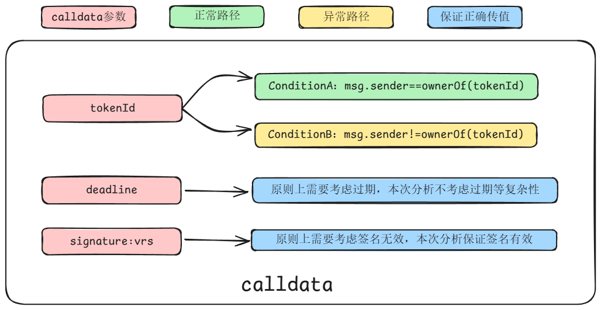

##### 存储

##### 分析结果

[calldata]中仅存在一条可达路径，综合[状态存储]发现3条可达的执行路径，2条revert路径，以线性时序逻辑 (LTL) 语言表示如下：

###### WillSucceed:未超期

,msg.sender==ownerOf(tokenId)&&msg.sender== recover(vrs) &&block.timestamp\<=rentOrder[tokenId].expiryTime&&rentOrder[tokenId].orderState==OrderState.Borrowing)) ==\> \<\>(finished(contract.takerRedeem(tokenId,deadline,v,r,s), return == true ==\>rentOrder[tokenId].orderState==OrderState.Redeemed&&cancelSignatures==old(cancelSignatures)&&makerBalance[rentOrder[tokenId].maker]=old(makerBalance[rentOrder[tokenId].maker])&&contract.balance-rentOrder[tokenId].collateral==old(contract.balance)&&new(ownerOf(tokenId))==rentOrder[tokenId].maker)))

###### WillSucceed:超期小于等于100天（每天扣1%,最多扣100天）

,msg.sender==ownerOf(tokenId)&&msg.sender== recover(vrs) &&block.timestamp-rentOrder[tokenId].expiryTime\<=100 days&&rentOrder[tokenId].orderState==OrderState.Borrowing)) ==\> \<\>(finished(contract.takerRedeem(tokenId,deadline,v,r,s), return == true ==\>rentOrder[tokenId].orderState==OrderState.Redeemed&&cancelSignatures[rentOrder[tokenId].maker]==old(cancelSignatures[rentOrder[tokenId].maker])&&makerBalance[rentOrder[tokenId].maker]=old(makerBalance[rentOrder[tokenId].maker]+rentOrder[tokenId].collateral\*((block.timestamp-rentOrder[tokenId].expiryTime)/86400)\*1%)&&contract.balance-(rentOrder[tokenId].collateral\*((block.timestamp-rentOrder[tokenId].expiryTime)/86400)\*1%)==old(contract.balance)&&new(ownerOf(tokenId))==rentOrder[tokenId].maker)))

###### WillSucceed:超期大于100天（扣除全部押金）

,msg.sender==ownerOf(tokenId)&&msg.sender== recover(vrs) &&block.timestamp-rentOrder[tokenId].expiryTime\>100 days&&rentOrder[tokenId].orderState==OrderState.Borrowing)) ==\> \<\>(finished(contract.takerRedeem(tokenId,deadline,v,r,s), return == true ==\>rentOrder[tokenId].orderState==OrderState.Redeemed&&cancelSignatures[rentOrder[tokenId].maker]==old(cancelSignatures[rentOrder[tokenId].maker])&&makerBalance[rentOrder[tokenId].maker]=old(makerBalance[rentOrder[tokenId].maker]+rentOrder[tokenId].collateral)&&contract.balance==old(contract.balance)&&new(ownerOf(tokenId))==rentOrder[tokenId].maker)))

###### Revert:NFT拥有者不是msg.sender

,msg.sender!=ownerOf(tokenId)) ==\> \<\>(reverted(contract.takerRedeem))

###### Revert:NFT已被清算\|\|重复赎回

,rentOrder[tokenId].orderState！=OrderState.Borrowing)) ==\> \<\>(reverted(contract.takerRedeem))

#### 2.3.3出租人清算

##### Calldata

##### 存储

##### 分析结果

根据calldata以及存储可得，1条可达路径，3条revert路径，，以线性时序逻辑 (LTL) 语言表示如下：

###### WillSucceed：调用成功

,msg.sender==rentOrder[tokenId].maker&&block.timestamp-orderRent[tokenId].expiryTime\>12days&&rentOrder[tokenId].orderState==OrderState.Borrowing)) ==\> \<\>(finished(contract.makerClear(tokenId), return == true ==\>rentOrder[tokenId].orderState==OrderState.MakerClear&&cancelSignatures==old(cancelSignatures)&&makerBalance[msg.sender]=0)&&contract.balance-rentOrder[tokenId].collateral-start(makerBalance[msg.sender])==old(contract.balance)&&new(ownerOf(tokenId))==rentOrder[tokenId].maker)))

###### Revert:msg.sender不是TokenId的出租人

,rentOrder[tokenId].maker！=msg.sender)) ==\> \<\>(reverted(contract.takerRedeem))

###### Revert：NFT出租订单的状态不是租借中

,rentOrder[tokenId].orderState！=OrderState.Borrowing)) ==\> \<\>(reverted(contract.takerRedeem))

###### Revert：超时未超过12天

,block.timestamp-orderRent[tokenId].expiryTime\<=12days)) ==\> \<\>(reverted(contract.takerRedeem))

#### 2.3.4出租人取消出租

##### Calldata

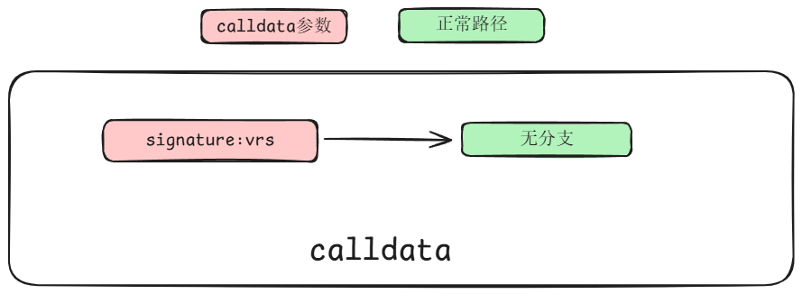

##### 存储

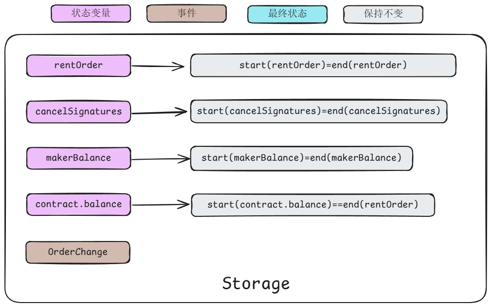

##### 分析结果

根据calldata以及存储可得，1条可达路径，0条revert路径，，以线性时序逻辑 (LTL) 语言表示如下：

###### WillSucceed：调用成功

,)) ==\> \<\>(finished(contract.cancelBorrow(uint8 v, bytes32 r, bytes32 s), return == true ==\>rentOrder==old(rentOrder)&&cancelSignatures[rsv]==true&&makerBalance==old(makerBalance)&&contract.balance==old(contract.balance))))

#### 2.3.5出租人提取租金

##### 存储

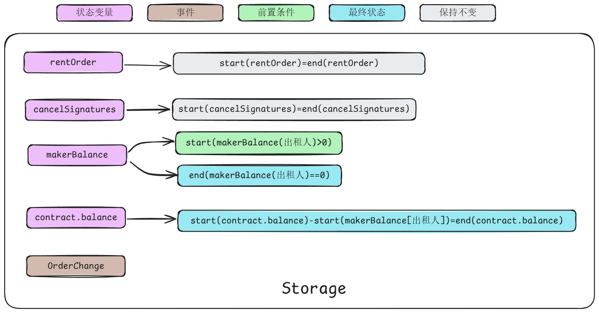

##### 分析结果

根据calldata以及存储可得，1条可达路径，1条revert路径，，以线性时序逻辑 (LTL) 语言表示如下：

###### WillSucceed：调用成功

,makerBalance[msg.sender]\>0)) ==\> \<\>(finished(contract.makerClaim(), return == true ==\>rentOrder==old(rentOrder)&&cancelSignatures==old(cancelSignatures)&&makerBalance[msg.sender]==0&&contract.balance==old(contract.balance)-makerBalance[msg.sender])))

###### Revert：没有租金可提取

,makerBalance[msg.sender]\<=0)) ==\> \<\>(reverted(contract.makerClaim))

### 2.4单元测试报告

对合约进行单元测试的目的是为了验证各函数的功能是否正常，不同条件的输入执行后达到相应的预期，本次使用Foundry框架开发单元测试用例，并使用forge命令测试。

#### 2.4.1单元测试用例

根据测试路径分析，RNRentMarket共得出19例单元测试用例，分支覆盖率达90%以上，分别如下:

-   testBorrow_willSucceed_stateUnkow() 承租人租赁NFT_NFT的订单状态是未知（首次出租）
-   testBorrow_willSucceed_stateRedeemed() 承租人租赁NFT_NFT的订单状态是已赎回
-   testBorrow_willSucceed_stateMakerClear() 承租人租赁NFT_NFT的订单状态是已清算
-   testBorrow_revert_selfBorrow() 承租人租赁NFT_租用自己的NFT
-   testBorrow_revert_notEnoughPayment() 承租人租赁NFT_支付ETH不足，小于（押金+租金）
-   testBorrow_revert_overflowDailyRentAndRentalDuration() 承租人租赁NFT_溢出（日租金\*租借时间）
-   testBorrow_revert_stateBorrowing() 承租人租赁NFT_租借已出租的NFT
-   testBorrow_revert_signatureCancel() 承租人租赁NFT_签名已取消
-   testTakerRedeem_willSucceed() 承租人赎回押金并归还NFT_未超时正常赎回
-   testTakerRedeem_willSucceed_timeoutLess100Days() 承租人赎回押金并归还NFT_超时时间小于100天（超时后每天扣1%,最多扣100天）
-   testTakerRedeem_willSucceed_timeoutGreater100Days() 承租人赎回押金并归还NFT_超期大于100天（超时后每天扣1%,100天后押金清0）
-   testTakerRedeem_revert_notNFTOwner() 承租人赎回押金并归还NFT_赎回人不是NFT的拥有者
-   testTakerRedeem_revert_makeClear() 承租人赎回押金并归还NFT_NFT已被出租人清算（超过12天出租人可主动清算）
-   testMakerClear_willSucceed() 出租人清算_超时已超过12天，正常清算
-   testMakerClear_revert_redeemed() 出租人清算_NFT已被赎回
-   testMakerClear_revert_repeatMakerClear() 出租人清算_NFT重复清算
-   testSignatureCancel_willSucceed() 出租人取消出租_标记签名取消
-   testMakerClaim_willSucceed() 出租人提取租金_租金大于0
-   testMakerClaim_revert_zertRent() 出租人提取租金_租金等于0

#### 2.4.2执行报告

单元测试脚本合约命名为RTRentMarketUintTest，执行如下forge命令：

forge test --match-contract RTRentMarketUintTest

测试结果如下：

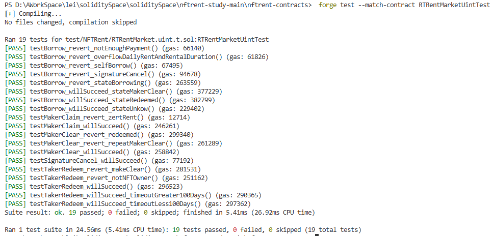

#### 2.4.3结果分析

19条单元测试用例均已测试通过。

### 2.5模糊测试报告

对于单元测试通过的用例，仍需要测试可达路径的边缘值，可使用模糊测试进行验证，本次模糊测试仍使用Foundry框架开发，并使用forge组件执行。

#### 2.5.1模糊测试用例

根据测试路径分析，RNRentMarket共得出19例单元测试用例，提取其中willSucceed分支，并筛选出需要calldata参数的9条测试用例，进行模糊测试（同形式化验证测试用例），用例如下:

-   testBorrow_willSucceed_stateUnkow() 承租人租赁NFT_NFT的订单状态是未知（首次出租）
-   testBorrow_willSucceed_stateRedeemed() 承租人租赁NFT_NFT的订单状态是已赎回
-   testBorrow_willSucceed_stateMakerClear() 承租人租赁NFT_NFT的订单状态是已清算
-   testTakerRedeem_willSucceed() 承租人赎回押金并归还NFT_未超时正常赎回
-   testTakerRedeem_willSucceed_timeoutLess100Days() 承租人赎回押金并归还NFT_超时时间小于100天（超时后每天扣1%,最多扣100天）
-   testTakerRedeem_willSucceed_timeoutGreater100Days() 承租人赎回押金并归还NFT_超期大于100天（超时后每天扣1%,100天后押金清0）
-   testMakerClear_willSucceed() 出租人清算_超时已超过12天，正常清算
-   testSignatureCancel_willSucceed() 出租人取消出租_标记签名取消
-   testMakerClaim_willSucceed() 出租人提取租金_租金大于0

#### 2.5.2执行报告

模糊测试脚本合约命名为RTRentMarketFuzzTest，执行如下forge命令：

forge test --fuzz-runs {次数} --match-contract RTRentMarketFuzzTest

##### --fuzz-runs=100

##### --fuzz-runs=500

##### --fuzz-runs=2000

##### --fuzz-runs=5000

##### --fuzz-runs=10000

#### 2.5.3结果分析

使用[100\|500\|2000\|5000\|10000]不同的运行次数进行模糊测试后均测试通过。

### 2.6形式化验证报告

模糊测试的随机性测试虽然很有效，但并不具备全路径的完备性，故此可使用形式化验证以辅助测试，本次测试使用a16z的halmos工具进行验证，使用z3 .yices.cvc5等求解器进行测试，验证是否出现反例。

#### 2.6.1形式化验证测试用例

根据测试路径分析，RNRentMarket共得出19例单元测试用例，提取其中willSucceed分支，并筛选出需要calldata参数的9条测试用例，进行形式化验证（同模糊测试测试用例），用例如下:

-   check_testBorrow_willSucceed_stateUnkow() 承租人租赁NFT_NFT的订单状态是未知（首次出租）
-   check_testBorrow_willSucceed_stateRedeemed() 承租人租赁NFT_NFT的订单状态是已赎回
-   check_testBorrow_willSucceed_stateMakerClear() 承租人租赁NFT_NFT的订单状态是已清算
-   check_testTakerRedeem_willSucceed() 承租人赎回押金并归还NFT_未超时正常赎回
-   check_testTakerRedeem_willSucceed_timeoutLess100Days() 承租人赎回押金并归还NFT_超时时间小于100天（超时后每天扣1%,最多扣100天）
-   check_testTakerRedeem_willSucceed_timeoutGreater100Days() 承租人赎回押金并归还NFT_超期大于100天（超时后每天扣1%,100天后押金清0）
-   check_testMakerClear_willSucceed() 出租人清算_超时已超过12天，正常清算
-   check_testSignatureCancel_willSucceed() 出租人取消出租_标记签名取消
-   check_testMakerClaim_willSucceed() 出租人提取租金_租金大于0

#### 2.6.2执行报告

形式化验证测试脚本合约命名为RTRentMarketHalmosTest，执行如下命令：

halmos --match-contract RTRentMarketHalmosTest --solver {求解器：z3\|yices\|cvc5}

##### z3

##### yices

##### cvc5

#### 2.6.3结果分析

使用holmas工具，并组合z3.yices.cvc5求解器均未求得反例，故验证通过。

### 2.7不变测试报告

单元测试验证了单个合约函数的行为符合预期；模糊测试和形式化验证相互辅助，验证特定函数执行路径下是否具有破坏合约安全的特殊用例；但对于合约函数的随机调用并没有具体验证，故需要使用不变测试验证在可达路径过程中执行其他函数是否会对合约造成破坏。

#### 2.7.1不变测试用例

在模糊测试的可达路径中进行不变量测试用例，共9条测试用例：

-   check_testBorrow_willSucceed_stateUnkow() 承租人租赁NFT_NFT的订单状态是未知（首次出租）
-   check_testBorrow_willSucceed_stateRedeemed() 承租人租赁NFT_NFT的订单状态是已赎回
-   check_testBorrow_willSucceed_stateMakerClear() 承租人租赁NFT_NFT的订单状态是已清算
-   check_testTakerRedeem_willSucceed() 承租人赎回押金并归还NFT_未超时正常赎回
-   check_testTakerRedeem_willSucceed_timeoutLess100Days() 承租人赎回押金并归还NFT_超时时间小于100天（超时后每天扣1%,最多扣100天）
-   check_testTakerRedeem_willSucceed_timeoutGreater100Days() 承租人赎回押金并归还NFT_超期大于100天（超时后每天扣1%,100天后押金清0）
-   check_testMakerClear_willSucceed() 出租人清算_超时已超过12天，正常清算
-   check_testSignatureCancel_willSucceed() 出租人取消出租_标记签名取消
-   check_testMakerClaim_willSucceed() 出租人提取租金_租金大于0

#### 2.7.2不变测试Handler

测试用例执行期间随机执行的Handler函数：

-   testBorrow_allCondition() 承租人租赁NFT_所有可达路径
-   testTakerRedeem_allCondition() 承租人赎回押金并归还NFT_所有可达路径
-   testMakerClear_allCondition() 出租人清算__所有可达路径
-   testSignatureCancel_allCondition() 出租人取消出租__所有可达路径
-   testMakerClaim_allCondition() 出租人提取租金__所有可达路径

#### 2.7.3执行报告

不变量测试Handler合约命名为RTRentMarketHandler，脚本合约命名为RTRentMarketInvariantTest，执行如下命令：

forge test --match-contract RTRentMarketInvariantTest

foundry.toml中的不变测试配置：

[invariant]

runs = 200

depth = 50

fail_on_revert = false

执行结果如下：

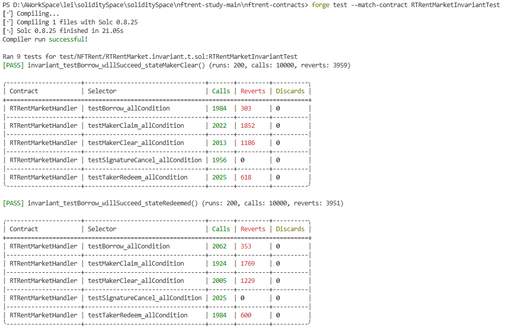

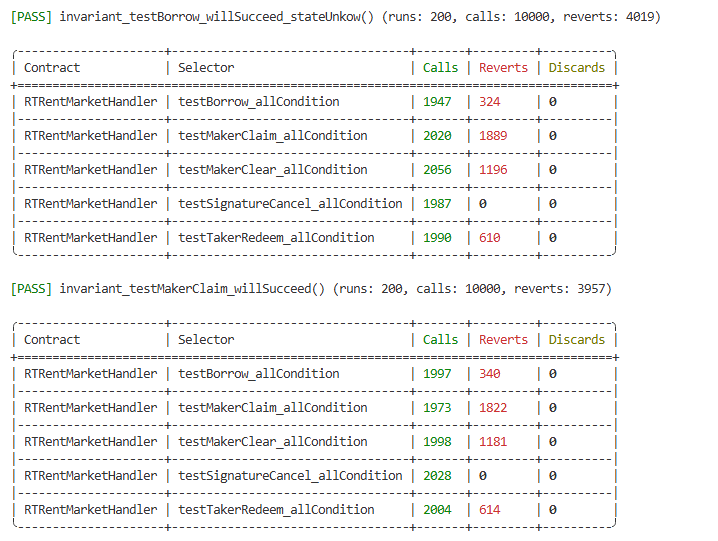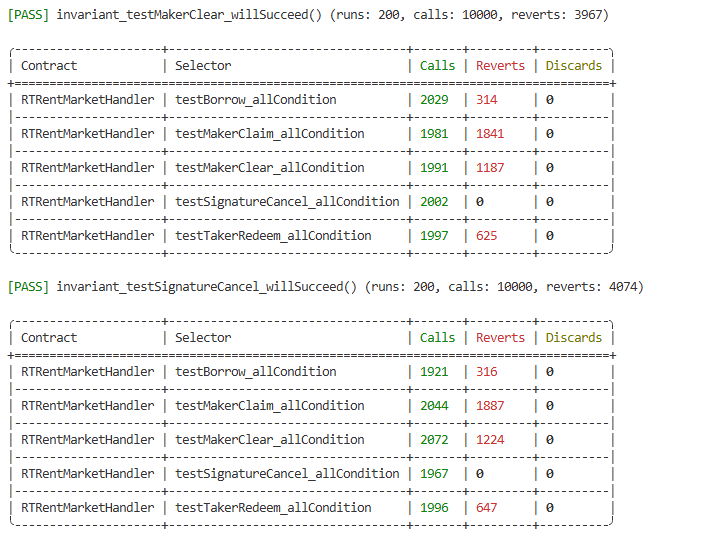

#### 2.7.4结果分析

不变测试期间，所有Handler中定义的场景函数均有执行，模糊测试中使用的用户与Handler中定义的用户已做隔离，且9条测试用例均已验证通过，得出结论，用户的合约交互操作不会影响其他用户的合约安全。

## 附录三、合约部署

### 3.1部署与验证脚本

脚本位于合约RTRentMarketScript.s.sol内,RTNFT以及RTRentMarket合约同时部署，执行如下部署命令：

forge script --rpc-url sepolia --account metamask script/RTRentMarket.s.sol --broadcast --verify

合约验证出现异常，执行如下命令重新验证：

forge verify-contract --rpc-url sepolia 0x714F6eA9909D934f02448EDd2D89deA8c3Bc83f9

forge verify-contract --rpc-url sepolia 0xec46647CAD209B947346c9049Ee409436208B119

### 3.2合约地址

-   网络: Ethereum Sepolia Testnet (ChainID: 11155111)
-   合约地址:

RTNFT: 0x714F6eA9909D934f02448EDd2D89deA8c3Bc83f9

RTRentMarket: 0xec46647CAD209B947346c9049Ee409436208B119

-   验证状态: 合约源码已通过Etherscan验证。
